# Cryptographic Accumulators for ZK Nullifiers (EVM-oriented)

> **Status:** initial draft (README.md).
> **Scope:** practical, on-chain-verifiable accumulators to implement *nullifiers* in zero-knowledge systems, with an emphasis on Ethereum / EVM.

---

## Why accumulators for nullifiers?

A **nullifier** is a unique tag (typically a field element or hash) published once to prevent double-use of a secret (e.g., spending an anonymous note). On chain we need to enforce:

1. **Uniqueness:** a nullifier $N$ must not have appeared before (non-membership at spend time), then it is added to the *spent* set.
2. **Compact state:** the on-chain state should be constant-size or at least *logarithmic*, so gas stays bounded as the set grows.
3. **Fast verification:** verifiers (contracts) should check membership/non-membership efficiently using precompiles where possible.
4. **Updatability:** appending a new nullifier should be simple; existing witnesses should either remain valid or be updatable cheaply.
5. **Trust & assumptions:** minimal trusted setup; clear cryptographic assumptions; smooth UX for provers.

An **accumulator** is a short commitment to a (growing) set $S$ that supports short proofs of *membership* ($x\in S$) and, in some designs, *non-membership* ($x\notin S$).

---

## Notation

* Let $S \subset \mathcal{U}$ be the current set of nullifiers.
* An **accumulator value** $\mathsf{Acc}(S)$ is a short digest/commitment stored on chain.
* A **witness** for $e\in\mathcal{U}$ is denoted $\mathsf{w}_e$.
* Pairing groups use generator $g\in G_1$, secret $\tau\in\mathbb{F}_p$, bilinear map $e:G_1\times G_2\to G_T$.
* RSA groups use unknown order modulus $N$ and generator $g\in \mathbb{Z}_N^*$.
* Hashes: $\mathsf{H}(\cdot)$; hash-to-prime $\mathsf{Hp}(\cdot)$ when required.

---

## Requirements for the ZK-Nullifier use case

* **Append-only:** once a nullifier is published, it remains in the set.
* **Operations needed**

  * **Non-membership** at spend time: prove $N\notin S_{\text{spent}}$ (or, equivalently, prove $N$ was *not* committed previously).
  * **Membership** at conflict resolution / fraud proofs: show $N\in S$ (e.g., to justify that a duplicate spend is invalid).
* **On-chain footprint**

  * One accumulator word (or a few curve points).
  * Proof sizes: constant or logarithmic.
  * Verification chores aligned with EVM precompiles (BN254 pairings, keccak/Poseidon, modexp).
* **Witness maintenance**

  * Ideally: existing users need not track every update.
  * Practically: if updates are needed, they should be cheap or server-assisted.

---

## Families of accumulators covered

1. **(Sparse) Merkle Trees (SMT)**
2. **Pairing-based (Nguyen/Boneh–Boyen-style)**
3. **KZG-based (polynomial-commitment set accumulators)**
4. **Verkle Trees (KZG vector-commitment trees)**
5. **RSA-based (Benaloh–de Mare / Camenisch–Lysyanskaya-style)**

Each chapter details math, witness maintenance, (non)membership, and complexity.

---

## 1. (Sparse) Merkle Trees

### Construction (append-only, key–value set)

For a fixed key domain (e.g., $2^{256}$), define a full binary tree of depth $d$ with default value $\bot$.

* Leaves: at index $i=\mathsf{H}(e)$ store value $v_i$ (e.g., $1$ for "present").
* Internal nodes: hash of children; root $R$ is on chain.

```mermaid
graph TD
    Root["Root R<br/>(on-chain)"]
    N1["H(N2||N3)"]
    N2["H(N4||N5)"]
    N3["H(N6||N7)"]
    N4["H(leaf||⊥)"]
    N5["H(leaf||1)"]
    N6["H(⊥||⊥)"]
    N7["H(⊥||⊥)"]
    
    Root --> N1
    N1 --> N2
    N1 --> N3
    N2 --> N4
    N2 --> N5
    N3 --> N6
    N3 --> N7
    
    style Root fill:#e1f5ff
    style N5 fill:#c8e6c9
    style N4 fill:#fff9c4
    style N6 fill:#ffccbc
    style N7 fill:#ffccbc
    
    classDef proof stroke:#ff6b6b,stroke-width:3px
    class N2,N3 proof
```

*Diagram: Binary Merkle tree with membership proof path (red outline) showing siblings needed to verify leaf N5.*

**Membership proof** for $e$ is the path of sibling hashes from leaf to root:

$$
\pi_e=\{h_0,\dots,h_{d-1}\},\quad \text{size } O(\log |\mathcal{U}|).
$$

**Non-membership** in *sparse* trees uses the canonical $\bot$ leaf: the proof shows the path leads to the default leaf at index $\mathsf{H}(e)$.

### Updates

Append $e$ by setting leaf $i$ from $\bot$ to $1$ and re-hashing along the path: $O(\log |\mathcal{U}|)$ node updates.

### Prover state, witnesses, and maintenance

* **Prover keeps:** either nothing (can query a full node for a proof) or the last proof $\pi_e$.
* **On addition of any new element:** a previously stored $\pi_e$ may become stale; can be *updated* with $O(\log |\mathcal{U}|)$ sibling replacements or simply re-queried.

### (Non)membership & verification

* **Membership:** verify path recomputation ends at $R$.
* **Non-membership (sparse):** verify path ends at default leaf at index $\mathsf{H}(e)$.

### Complexity (asymptotic)

* **Witness size:** $O(\log |\mathcal{U}|)$ hashes.
* **Prover time:** generate/update proof $O(\log |\mathcal{U}|)$.
* **Verifier time/space:** recompute $O(\log |\mathcal{U}|)$ hashes; on chain, gas $\propto$ path length.

### EVM notes

* **Pros:** No trusted setup; easy append; non-membership supported (sparse); gas-predictable (hash loops).
* **Cons:** Proofs/log gas grow with depth; Poseidon (for ZK) vs Keccak (for EVM) trade-offs.

---

## 2. Pairing-based accumulators (Nguyen / Boneh–Boyen style)

These accumulate *linear factors* in the exponent using a secret $s$ at setup.

### Setup

Pick secret $s\in\mathbb{F}_p$; publish $(g, g^s)$ (and often $g^{s^i}$ for bounded universes). Encode each element $e$ as a field element.

```mermaid
graph LR
    subgraph Setup["Trusted Setup"]
        S["Secret s ∈ 𝔽ₚ"]
        G["g, g^s, g^(s²), ..."]
    end
    
    subgraph Accumulator["Accumulator Value"]
        ACC["Acc(S) = g^∏(s+xᵢ)"]
    end
    
    subgraph Witness["Membership Witness for e"]
        W["wₑ = g^∏(s+xᵢ), i≠e"]
    end
    
    subgraph Verify["Verification (1 pairing)"]
        V["e(wₑ, g^(s+e)) ?= e(Acc(S), g)"]
    end
    
    S -.trapdoor.-> G
    G --> ACC
    G --> W
    ACC --> V
    W --> V
    
    style S fill:#ffcccc
    style ACC fill:#e1f5ff
    style W fill:#fff9c4
    style V fill:#c8e6c9
```

*Diagram: Pairing-based accumulator flow showing trusted setup, constant-size witness, and single-pairing verification.*

### Accumulator and witnesses

Define

$$
\mathsf{Acc}(S)=g^{\prod_{x\in S} (s+x)}.
$$

For $e\in S$, a membership witness is

$$
\mathsf{w}_e = g^{\prod_{x\in S\setminus\{e\}} (s+x)}.
$$

**Verification** uses one pairing:

$$
 e(\mathsf{w}_e, g^{s+e}) \stackrel{?}{=} e(\mathsf{Acc}(S), g).
$$

### Updates

Appending $y$ should transform

$$
\mathsf{Acc}(S\cup\{y\}) = \mathsf{Acc}(S)^{(s+y)}.
$$

But exponent $(s+y)$ is *unknown* publicly; thus:

* Without trapdoor access or extra update keys, **public updates are not possible from $\mathsf{Acc}(S)$ alone.**
* A manager (with $s$ or suitable update material) can compute the new accumulator and **re-issue** witnesses.

### Prover state & maintenance

* **Prover keeps:** either just $e$ (and fetches a fresh $\mathsf{w}_e$ each time), or the latest $\mathsf{w}_e$.
* **On each append:** existing $\mathsf{w}_e$ becomes invalid; requires re-issuance or heavy recomputation with secret $s$.

### (Non)membership

* **Membership:** supported (constant-size, one pairing).
* **Non-membership:** *not native.* Universal/non-membership variants exist but require additional structures (e.g., auxiliary accumulators or Bezout-style relations in pairing groups) and typically more parameters.

### Complexity

* **Witness size:** $O(1)$ group element.
* **Prover:** trivial if a manager serves updated witnesses; otherwise impractical (needs $s$).
* **Verifier:** constant pairings (usually one).
* **On-chain:** pairing precompile friendly; requires trusted setup (trapdoor $s$ or updatable SRS).

---

## 3. KZG-based set accumulators (polynomial commitments)

Use the characteristic polynomial of $S$ with a KZG commitment.

### Setup

Structured Reference String (SRS) for degree $\ge |S|$:

$$
\mathsf{SRS}=\big(g, g^\tau, g^{\tau^2},\ldots\big).
$$

```mermaid
graph TB
    subgraph SRS["Structured Reference String"]
        T["τ (secret)"]
        SRS_P["g, g^τ, g^(τ²), ..., g^(τᵈ)"]
    end
    
    subgraph Polynomial["Characteristic Polynomial"]
        F["f_S(x) = ∏(x - eᵢ) for eᵢ ∈ S"]
    end
    
    subgraph Commit["Accumulator (KZG Commitment)"]
        C["Acc(S) = C = g^(f_S(τ))"]
    end
    
    subgraph Member["Membership for e ∈ S"]
        Q["q(x) = f_S(x)/(x-e)"]
        WM["wₑ = g^(q(τ))"]
        VM["e(wₑ, g^(τ-e)) ?= e(C, g)"]
    end
    
    subgraph NonMember["Non-membership for y ∉ S (Bézout)"]
        B["u·f_S + v·(x-y) = 1"]
        WN["Wᵤ = g^(u(τ)), Wᵥ = g^(v(τ))"]
        VN["e(Wᵤ,C)·e(Wᵥ,g^(τ-y)) ?= e(g,g)"]
    end
    
    T -.setup.-> SRS_P
    SRS_P --> F
    F --> C
    F --> Q
    Q --> WM
    C --> VM
    WM --> VM
    
    F --> B
    B --> WN
    C --> VN
    WN --> VN
    
    style T fill:#ffcccc
    style C fill:#e1f5ff
    style VM fill:#c8e6c9
    style VN fill:#c8e6c9
```

*Diagram: KZG-based accumulator showing both membership (via quotient polynomial) and non-membership (via Bézout relation) proofs.*

### Accumulator

Characteristic polynomial

$$
f_S(x)=\prod_{e\in S} (x-e).
$$

Commitment

$$
\mathsf{Acc}(S)=C=g^{f_S(\tau)}.
$$

### Membership witness

For $e\in S$ define the quotient

$$
q_e(x)=\frac{f_S(x)}{x-e}.
$$

Witness

$$
\mathsf{w}_e = g^{q_e(\tau)}.
$$

**Verify** with one pairing:

$$
 e(\mathsf{w}_e, g^{\tau - e}) \stackrel{?}{=} e(C, g).
$$

### Non-membership witness (Bézout relation)

For $y\notin S$, find polynomials $u(x),v(x)$ with

$$
u(x)\cdot f_S(x) + v(x)\cdot (x-y) = 1.
$$

Publish

$$
W_u = g^{u(\tau)}, \quad W_v = g^{v(\tau)}.
$$

**Verify**:

$$
 e(W_u, C)\cdot e(W_v, g^{\tau - y}) \stackrel{?}{=} e(g, g).
$$

### Updates

Appending $y$ changes $f_{S\cup\{y\}}(x)=f_S(x)(x-y)$ and

$$
C' = g^{f_S(\tau)(\tau-y)}.
$$

**Publicly deriving $C'$ from $C$ is *not* possible** without extra SRS material enabling multiplication by $(\tau-y)$. In practice:

* The *aggregator* recomputes $C'$ from coefficients (linear in $\deg f$) or maintains a product tree to keep it quasi-linear.
* Existing membership witnesses $\mathsf{w}_e$ must be **recomputed** or served as *updateable witnesses* if the system publishes update keys.

### Prover state & maintenance

* **Prover keeps:** element $e$ and most recent $\mathsf{w}_e$ (or fetches on demand).
* **On append:** witnesses stale; require server re-issuance. Public self-updates are not feasible without special keys.

### Complexity

* **Witness sizes:** constant ($G_1$ elements).
* **Prover:** light if served by aggregator; heavy otherwise.
* **Verifier:** constant pairings (1 for membership; 2 for non-membership as above).
* **Trust:** updatable/ceremony SRS; standard KZG assumptions.
* **On-chain:** excellent—BN254 pairing precompile.

---

## 4. Verkle Trees as Accumulators (KZG vector-commitment trees)

Verkle trees combine **high-arity trees** with **KZG vector commitments** at each internal node. They act as accumulators with **logarithmic-size** proofs (in the tree height) and KZG-style verification at each level. This makes them a middle ground between SMTs (hash-based, longer proofs) and constant-size KZG set accumulators (short proofs, but require a witness update service).

### Construction

- Choose a branching factor $b$ (e.g., $b=256$). Each internal node holds a vector $V\in \mathbb{F}_p^{b}$ of its children's digests (child commitments or values).
- Interpolate the unique polynomial $f\in \mathbb{F}_p[x]$ with $\deg f<b$ such that $f(i)=V_i$ for indices $i\in\{0,\dots,b-1\}$.
- Commit to the node using KZG: $C= g^{f(\tau)}$. The root commitment is stored on chain.
- Leaves store application values. For nullifiers, a leaf at index $i=\mathsf{H}(e)$ holds a presence bit (e.g., $1$).

```mermaid
graph TD
    subgraph Root["Root Level (depth 0)"]
        R["C₀ = g^(f₀(τ))<br/>Vector V⁰ = [C₁, C₂, ..., Cᵦ]"]
    end
    
    subgraph Level1["Internal Level (depth 1)"]
        C1["C₁ = g^(f₁(τ))<br/>V¹ = [C₁₁, ..., C₁ᵦ]"]
        C2["C₂ = g^(f₂(τ))<br/>V² = [C₂₁, ..., C₂ᵦ]"]
        Cdots["..."]
    end
    
    subgraph Leaves["Leaf Level (depth h)"]
        L1["Leaf: value=1<br/>(nullifier present)"]
        L2["Leaf: value=0<br/>(empty)"]
        L3["..."]
    end
    
    subgraph Proof["Membership Proof"]
        P["Path: (i₀, i₁, ..., iₕ₋₁)<br/>For each level k:<br/>• Cₖ (node commitment)<br/>• Wₖ = g^((fₖ(τ)-Vₖ[iₖ])/(τ-iₖ))<br/>• Open Vₖ[iₖ] (child pointer)"]
    end
    
    R --> C1
    R --> C2
    R --> Cdots
    C1 --> L1
    C1 --> L2
    C2 --> L3
    
    R -.proof path.-> C1
    C1 -.proof path.-> L1
    
    style R fill:#e1f5ff
    style C1 fill:#fff9c4
    style L1 fill:#c8e6c9
    style P fill:#e3f2fd
    
    classDef proofPath stroke:#ff6b6b,stroke-width:3px
    class R,C1,L1 proofPath
```

*Diagram: Verkle tree with branching factor b, showing KZG vector commitments at each level and a membership proof path (red outline).*

### Membership proof

For key $e$, let the path indices be $(i_0, i_1,\dots, i_{h-1})$ where $h=\lceil\log_b |\mathcal{U}|\rceil$. The proof provides, for each depth $k$:
- the node commitment $C_k$ and the opened value $V^{(k)}_{i_k}$ (which is the child pointer for the next level, or the leaf value at the last level), and
- a KZG evaluation witness

$$
W_k = g^{\frac{f_k(\tau)-V^{(k)}_{i_k}}{\tau - i_k}}.
$$

The verifier checks for each level

$$
 e(W_k,\; g^{\tau - i_k}) \stackrel{?}{=} e\!\Big(C_k / g^{V^{(k)}_{i_k}},\; g\Big),
$$

then continues with the child commitment revealed by $V^{(k)}_{i_k}$. At the leaf, it checks that the value equals $1$ (present).

### Non-membership proof

A non-membership proof shows that along the path, at some level $k$, the opened entry is the **default** (empty) value, e.g., $V^{(k)}_{i_k}=0$, using the same KZG opening equation as above; or that the leaf value equals $0$ (absent). Thus non-membership is natively supported via openings to default entries.

### Updates

Appending a new nullifier $y$ updates the leaf at index $i=\mathsf{H}(y)$ and the $h$ ancestor nodes on the path. For each affected node, recompute its vector entry and KZG commitment:

$$
C'_k = g^{f'_k(\tau)}\quad \text{with}\quad f'_k(i_k)=V'^{(k)}_{i_k},\; f'_k(j)=f_k(j)\; \forall j\neq i_k.
$$

This is **$O(h)$** work; no trapdoor is required. As with Merkle trees, previously cached proofs that traverse any changed node become stale and must be refreshed.

### Prover state & maintenance

- **Prover keeps:** optionally the last path proof; otherwise can recompute from the current tree. 
- **On append:** witnesses touching the updated path become stale; update cost is $O(h)$ (one node per level). No centralized witness-issuer is required.

### (Non)membership & verification

- **Membership:** $h$ KZG evaluation checks (one per level). 
- **Non-membership:** same structure, proving openings to default values.

### Complexity

- **Witness size:** $O(h)$ openings (each constant-size KZG proof), where $h=\lceil\log_b |\mathcal{U}|\rceil$.
- **Prover:** $O(h)$ to build a path proof; interpolation can be precomputed or done via fixed-domain Lagrange bases.
- **Verifier:** $O(h)$ pairings (often 1 per opening). Batch/multi-openings can reduce constants.
- **Trust:** requires a KZG SRS; same assumptions as KZG.
- **On-chain:** verification cost scales with $h$ pairings; with large $b$ (e.g., $256$), $h$ is small relative to a binary Merkle tree, but still larger than constant-size KZG set accumulators.

### EVM notes

- Uses BN254 pairing precompile; proof size and gas grow with tree height.
- Proofs are **shorter than SMT** (because $h$ is smaller) and do **not** require a witness update service, but they are **longer/heavier** to verify than constant-size KZG or pairing-based set accumulators.

---

## 5. RSA-based accumulators (unknown-order groups)

Accumulate primes in an unknown-order group; supports elegant public updates.

### Setup

* Choose RSA modulus $N$ with unknown factorization; generator $g\in \mathbb{Z}_N^*$.
* Map elements to primes via hash-to-prime $\mathsf{Hp}:\mathcal{U}\to \text{Primes}$.

```mermaid
graph TB
    subgraph Setup["Setup (No Trusted Party)"]
        N["RSA modulus N<br/>(unknown factorization)"]
        G["Generator g ∈ ℤ*_N"]
        HP["Hash-to-prime:<br/>Hp: 𝒰 → Primes"]
    end
    
    subgraph Accumulator["Accumulator Value"]
        ACC["Acc(S) = g^X mod N<br/>where X = ∏ Hp(eᵢ)"]
    end
    
    subgraph Member["Membership for e ∈ S"]
        WM["wₑ = g^(X/Hp(e)) mod N"]
        VM["Verify: wₑ^(Hp(e)) ?≡ Acc(S) mod N"]
    end
    
    subgraph Append["Public Append of y"]
        PY["p_y = Hp(y)"]
        UPDATE["Acc' = Acc^(p_y) mod N<br/>wₑ' = wₑ^(p_y) mod N<br/>w_y = Acc"]
    end
    
    subgraph NonMember["Non-membership for y ∉ S"]
        BEZ["Bézout: a·Hp(y) + b·X = 1"]
        WNM["d = g^a mod N<br/>Witness: (d, b)"]
        VNM["Verify: d^(Hp(y))·Acc^b ?≡ g mod N"]
    end
    
    N --> ACC
    G --> ACC
    HP --> ACC
    
    ACC --> WM
    WM --> VM
    
    ACC --> UPDATE
    PY --> UPDATE
    WM --> UPDATE
    
    ACC --> BEZ
    BEZ --> WNM
    WNM --> VNM
    
    style N fill:#e3f2fd
    style ACC fill:#e1f5ff
    style UPDATE fill:#c8e6c9
    style VM fill:#c8e6c9
    style VNM fill:#c8e6c9
```

*Diagram: RSA accumulator showing trust-minimal setup, public append capability, and both membership and non-membership proofs.*

### Accumulator and membership

Let $X=\prod_{e\in S}\mathsf{Hp}(e)$. Define

$$
\mathsf{Acc}(S)=A=g^X \bmod N.
$$

Membership witness for $e\in S$:

$$
\mathsf{w}_e = g^{X/\mathsf{Hp}(e)} \bmod N.
$$

**Verify** with one modexp:

$$
\mathsf{w}_e^{\mathsf{Hp}(e)} \stackrel{?}{\equiv} A \pmod N.
$$

### Public append (key advantage)

Append $y$ with prime $p_y=\mathsf{Hp}(y)$:

$$
A' = A^{p_y} \pmod N.
$$

Existing witnesses *publicly update* as

$$
\mathsf{w}_e' = \mathsf{w}_e^{p_y} \pmod N,\quad
\text{and } \mathsf{w}_y = A.
$$

No trapdoor required; everyone can update locally.

### Non-membership (universal accumulator)

Let $p=\mathsf{Hp}(y)$ and $X=\prod_{e\in S}\mathsf{Hp}(e)$ (note $\gcd(p,X)=1$ if $y\notin S$). Find integers $(a,b)$ s.t.

$$
a\cdot p + b\cdot X = 1.
$$

Set

$$
d = g^a \bmod N,\quad \text{witness } (d,b).
$$

**Verify**:

$$
d^{p}\cdot A^{b} \stackrel{?}{\equiv} g \pmod N.
$$

### Prover state & maintenance

* **Prover keeps:** a membership witness $\mathsf{w}_e$ that can be *locally* updated for each append (raise to $p_y$).
* **Non-membership:** computing $(a,b)$ requires Bezout on $(p,X)$—practical with a *subset-product tree* or server assistance (you need $X$ modulo $p$).

### Off-chain maintenance via a product tree (classic & KL)

```mermaid
graph TD
    subgraph Tree["Binary Product Tree"]
        Root["Root: X = ∏ pᵢ<br/>(all elements)"]
        L1["∏ p₁..p₄"]
        R1["∏ p₅..p₈"]
        L2["p₁·p₂"]
        R2["p₃·p₄"]
        L3["p₅·p₆"]
        R3["p₇·p₈"]
        E1["p₁=Hp(e₁)"]
        E2["p₂=Hp(e₂)"]
        E3["p₃=Hp(e₃)"]
        E4["p₄=Hp(e₄)"]
        E5["p₅=Hp(e₅)"]
        E6["p₆=Hp(e₆)"]
        E7["p₇=Hp(e₇)"]
        E8["p₈=Hp(e₈)"]
    end
    
    subgraph Witness["Witness Generation for e₃"]
        W["X₋₃ = (p₁·p₂)·p₄·(p₅·p₆·p₇·p₈)<br/>w₃ = g^(X₋₃) mod N"]
        Siblings["Multiply sibling<br/>subtree products:<br/>• p₁·p₂ (sibling)<br/>• p₄ (sibling)<br/>• ∏p₅..p₈ (sibling)"]
    end
    
    Root --> L1
    Root --> R1
    L1 --> L2
    L1 --> R2
    R1 --> L3
    R1 --> R3
    L2 --> E1
    L2 --> E2
    R2 --> E3
    R2 --> E4
    L3 --> E5
    L3 --> E6
    R3 --> E7
    R3 --> E8
    
    L2 -.sibling.-> Siblings
    E4 -.sibling.-> Siblings
    R1 -.sibling.-> Siblings
    Siblings --> W
    
    style Root fill:#e1f5ff
    style E3 fill:#c8e6c9
    style W fill:#fff9c4
    
    classDef siblingPath stroke:#ff6b6b,stroke-width:3px
    class L2,E4,R1 siblingPath
```

*Diagram: Binary product tree for efficient RSA witness generation. To compute witness for e₃, multiply sibling subtree products (red outline) along the path.*

Maintain a binary **product tree** over the set, where leaves store per-element exponents and each internal node stores the product of its two children (as big integers):

- **Leaves:**
  - *Classic RSA:* \(p_e=\mathsf{Hp}(e)\) (distinct primes).
  - *Kemmoe–Lysyanskaya (KL):* use the scheme’s per-element update exponent \(u_e\) (no hash-to-prime).
- **Internal nodes:** product of children exponents; the **root** holds \(X=\prod_{x\in S} p_x\) in the classic variant, or \(X=\prod_{x\in S} u_x\) in KL.

This supports efficient maintenance:
- **Build / rebuild** the accumulator: compute \(A=g^{X} \bmod N\) from the root.
- **From-scratch membership witness** for element \(e\): multiply sibling-subtree products along the path to get \(X_{\neg e}=\prod_{x\in S\setminus\{e\}} (\cdot)\), then set \(\mathsf{w}_e=g^{X_{\neg e}}\bmod N\). (Works with primes \(p_x\) or general exponents \(u_x\).)
- **Append \(y\)** (already public-appendable): update *existing* witnesses locally by powering up with the new leaf exponent: \(\mathsf{w}_e \leftarrow \mathsf{w}_e^{p_y}\) in classic RSA, or \(\mathsf{w}_e \leftarrow \mathsf{w}_e^{u_y}\) in KL.
- **Selective refresh:** only witnesses whose path intersects the appended leaf need recomputation from the tree (\(O(\log n)\) nodes), rather than touching all nullifiers.

**Non-membership:**
- *Classic RSA:* uses Bézout with \(\gcd(p_y, X)=1\); the tree helps compute aggregates (and residues) quickly.
- *KL variant:* \(u_y\) need not be prime/coprime, so use the KL non-membership relation (not Bézout on primes). The same tree still helps assemble the required aggregate exponents; only the verification equation changes.

* **Witness size:** $O(1)$ (one or two $\bmod N$ elements).
* **Append & witness updates:** $O(1)$ modular exponentiations *publicly*.
* **Verifier:** one modular exponent for membership; a couple for non-membership.
* **Trust:** strong RSA/unknown-order assumption; classic variant needs sound hash-to-prime, while the Kemmoe–Lysyanskaya variant avoids hashing to primes.
* **On-chain:** uses `modexp` precompile; gas is materially higher than BN254 pairing, but append & client updates are superb off chain.

### Variant: no hash-to-prime (Kemmoe–Lysyanskaya, 2024)

Kemmoe and Lysyanskaya (CCS 2024; IACR ePrint 2024/505) give an RSA-based **dynamic universal** accumulator that **does not require mapping elements to primes**. Elements can be accumulated in their native representation, while retaining constant-size witnesses and efficient verification in the unknown-order group. This removes the hash-to-prime step (and its engineering overhead) yet keeps **public append** semantics characteristic of RSA accumulators.

*EVM note:* Verification still uses modular exponentiation via the `modexp` precompile. On-chain costs are comparable to classic RSA accumulators (pairing-based schemes are typically cheaper to verify on BN254 but lack public-update UX). The main benefit here is **eliminating hash-to-prime** in the client stack.

---

## Summary & Comparisons

```mermaid
graph TD
    Start([Choose Accumulator<br/>for ZK Nullifiers])
    
    Q1{Need constant-size<br/>proofs?}
    Q2{Can run witness<br/>update service?}
    Q3{EVM verify cost<br/>critical?}
    Q4{Want trust-minimal<br/>setup?}
    Q5{Want client-side<br/>witness updates?}
    
    SMT[Sparse Merkle Tree<br/>✓ No setup<br/>✓ Simple<br/>○ O log U proof]
    Verkle[Verkle Tree<br/>✓ Shorter than SMT<br/>✓ No witness server<br/>○ O h pairings]
    KZG[KZG Accumulator<br/>✓ Constant proof<br/>✓ Native non-membership<br/>✗ Needs witness server]
    Pairing[Pairing-based<br/>✓ Constant proof<br/>✓ Low gas<br/>✗ Needs witness server<br/>✗ Limited non-membership]
    RSA[RSA Accumulator<br/>✓ Self-updating witnesses<br/>✓ No setup<br/>○ Higher verify gas]
    
    Start --> Q1
    Q1 -->|No| Q4
    Q1 -->|Yes| Q2
    
    Q2 -->|Yes| Q3
    Q2 -->|No| Q5
    
    Q3 -->|Yes| Pairing
    Q3 -->|Flexible| KZG
    
    Q4 -->|Yes| SMT
    Q4 -->|Flexible| Verkle
    
    Q5 -->|Yes| RSA
    Q5 -->|No| KZG
    
    style Start fill:#e3f2fd
    style SMT fill:#c8e6c9
    style Verkle fill:#fff9c4
    style KZG fill:#ffe0b2
    style Pairing fill:#ffe0b2
    style RSA fill:#f8bbd0
```

*Diagram: Decision tree for selecting an accumulator based on requirements and constraints.*

### Feature matrix (qualitative)

| Accumulator               | Setup trust              | Proof size  | Verify cost (EVM)  | Append (public?)       | Witness upkeep on append         | Non-membership           | Deletions         | Typical fit for ZK nullifiers                                           |
| ------------------------- | ------------------------ | ----------- | ------------------ | ---------------------- | -------------------------------- | ------------------------ | ----------------- | ----------------------------------------------------------------------- |
| Sparse Merkle Tree        | None                     | $O(\log U)$ | $O(\log U)$ hashes | Yes                    | Needs path refresh ($O(\log U)$) | Yes (sparse default)     | Hard (but doable) | Simple, robust, cheap gas per leaf; larger proofs                       |
| Pairing-based (Nguyen/BB) | Trapdoor $s$ (or SRS)    | $O(1)$      | Few pairings       | **No** (needs manager) | Re-issue each time               | Not native (needs extra) | Non-trivial       | Great on-chain verify; operationally needs a witness server             |
| KZG set accumulator       | SRS (KZG)                | $O(1)$      | 1–2 pairings       | **No** (needs manager) | Re-issue each time               | **Yes** (Bézout)         | Non-trivial       | Best constant-size with native non-membership; needs server for updates |
| Verkle (KZG VC tree)     | SRS (KZG)                | $O(\log_b U)$ openings | $\approx h$ pairings    | Yes (tree updates)    | Path-based $O(h)$         | Yes (default openings) | Possible          | Middle ground: shorter than SMT; no witness server; heavier than constant-size |
| RSA accumulator           | None (but unknown-order) | $O(1)$      | Modexp (costly)    | **Yes** (public)       | **Local $O(1)$** power-up        | **Yes** (Bezout)         | Possible          | Superb client-side UX; on-chain verify heavier than pairings            |

> $U$ = keyspace size (e.g., $2^{256}$).

### High-level guidance

* **If you want minimal on-chain gas per proof and constant sizes:** KZG or pairing-based on BN254 are natural (pairing precompile). But you must operate a **witness update service**.
* **If you want a middle ground without a witness server:** Verkle trees give shorter proofs than SMTs and don’t require per-append witness re-issuance; on-chain verify scales with path length ($h$ pairings).
* **If you value self-updating client witnesses and trust-minimal setup:** RSA accumulators shine off chain; on chain, membership verification is heavier.
* **If you need no ceremonies and easy non-membership with simple infra:** Sparse Merkle Trees are operationally simple, with predictable on-chain costs that grow $\log U$.

---

### Witness Update Patterns

```mermaid
sequenceDiagram
    participant User
    participant Contract
    participant Server
    
    Note over User,Server: Pattern 1: Server-Assisted (KZG/Pairing)
    
    User->>Contract: Read Acc(S)
    Contract-->>User: Current accumulator
    User->>Server: Request witness for e
    Server->>Server: Compute w_e from current S
    Server-->>User: Fresh witness w_e
    User->>Contract: Submit proof with w_e
    Contract->>Contract: Verify & append nullifier
    
    Note over User,Server: Pattern 2: Self-Update (RSA)
    
    User->>User: Stored w_e from last use
    User->>Contract: Query new nullifiers since last
    Contract-->>User: {y₁, y₂, ...}
    User->>User: w_e' = w_e^(p₁·p₂·...) mod N
    User->>Contract: Submit proof with w_e'
    Contract->>Contract: Verify & append
    
    Note over User,Server: Pattern 3: Path Refresh (SMT/Verkle)
    
    User->>User: Cached proof π_e
    User->>Contract: Query updated siblings on path
    Contract-->>User: New sibling hashes/commitments
    User->>User: Recompute path proof π_e'
    User->>Contract: Submit π_e'
    Contract->>Contract: Verify against root
```

*Diagram: Three witness update patterns showing how different accumulator types handle witness maintenance.*

---

## Security & Engineering Notes

* **Domain separation:** hash nullifiers into the accumulator’s field/group domain (and to primes for RSA).
* **Soundness vs collisions:** Merkle depends on the hash; KZG/pairing depend on discrete-log/bilinear assumptions; RSA depends on Strong RSA/unknown order and secure $\mathsf{Hp}$.
* **Batching:** all families support batching tricks (multi-openings for KZG, multi-pairing equations, Merkle multiproofs, batched modexp for RSA).
* **Persistence:** store only the accumulator and (optionally) a recent epoch number to help clients coordinate witness updates.
* **Deletions:** not needed for nullifiers; if ever required, SMTs handle it; RSA and pairing/KZG require specialized protocols.

---

## Appendix A — Formal details

### Sparse Merkle verification

For sibling list $\pi_e=(s_0,\dots,s_{d-1})$ and bit-decomposition of $i=\mathsf{H}(e)$, define

$$
 h_0 = \mathsf{H}(\textsf{leaf}(e)),\quad
 h_{k+1}=\begin{cases}
  \mathsf{H}(h_k \| s_k) & \text{if } i_k=0 \\
  \mathsf{H}(s_k \| h_k) & \text{if } i_k=1
 \end{cases}
$$

Accept if $h_d=R$.

### Pairing-based membership check

$$
 e(\mathsf{w}_e, g^{s+e}) \stackrel{?}{=} e(\mathsf{Acc}(S), g).
$$

### KZG membership & non-membership

Membership:

$$
 e\!\left(g^{q_e(\tau)}, g^{\tau-e}\right) \stackrel{?}{=} e\!\left(g^{f_S(\tau)}, g\right).
$$

Non-membership (Bézout):

$$
 e\!\left(g^{u(\tau)}, g^{f_S(\tau)}\right)\cdot e\!\left(g^{v(\tau)}, g^{\tau-y}\right) \stackrel{?}{=} e(g,g).
$$

### RSA membership & non-membership

Membership:

$$
\left(\mathsf{w}_e\right)^{\mathsf{Hp}(e)} \stackrel{?}{\equiv} \mathsf{Acc}(S) \pmod N.
$$

Non-membership:

$$
d^{\mathsf{Hp}(y)}\cdot \mathsf{Acc}(S)^{b} \stackrel{?}{\equiv} g \pmod N
\quad\text{where } a\cdot \mathsf{Hp}(y)+b\cdot X=1,\ d=g^a.
$$

---

## Appendix B — Complexity summary (asymptotic)

Let $n=|S|$ and depth $d=\log U$.

* **SMT**

  * Witness size: $O(d)$.
  * Append: $O(d)$ recomputations.
  * Verify: $O(d)$ hashes.
* **Pairing-based**

  * Witness size: $O(1)$.
  * Append: needs manager; public append from digest alone not possible.
  * Verify: $O(1)$ pairings.
* **KZG**

  * Witness size: $O(1)$.
  * Append: needs manager (or special update keys).
  * Verify: membership $1$ pairing; non-membership $2$ pairings.
* **Verkle (branching factor $b$)**

  * Witness size: $O(h)$ where $h=\lceil\log_b U\rceil$.
  * Append: $O(h)$ (update $h$ nodes on the path).
  * Verify: $O(h)$ KZG openings (pairings), with optional batching.
* **RSA**

  * Witness size: $O(1)$.
  * Append: **public $O(1)$** modexp; witnesses power-up locally.
  * Verify: $O(1)$ modexp (membership), $O(1)$ more (non-membership).

---

## Practical design patterns for ZK nullifiers

* **On-chain minimalism:** store only $\mathsf{Acc}(S)$ and an epoch counter.
* **Off-chain service:** for KZG/pairing variants, run a stateless *witness distributor* that (a) recomputes $C$ on append, (b) serves fresh $\mathsf{w}_e$.
* **Client-friendly option:** RSA accumulators let wallets update their own witnesses when new nullifiers appear—great UX if on-chain modexp is acceptable.
* **Straightforward & ceremony-free:** SMTs with Poseidon give ZK-friendly hashing and predictable EVM verification with a loop over $d$ hashes.

---

## Final thoughts

No single accumulator dominates across all axes. For *EVM-first, constant-size proofs and low verify gas*, **KZG** (with Bézout non-membership) or **pairing-based** are the front-runners—provided you can operate a reliable witness update channel. For **trust-minimal client UX with self-updating witnesses**, **RSA accumulators** are compelling, trading higher on-chain verify cost for clean off-chain ergonomics. When **simplicity and zero ceremonies** matter most, **Sparse Merkle Trees** remain an excellent baseline.

> Next steps you might want to add: concrete gas benchmarks per operation (pairings vs keccak/poseidon vs modexp), serialization formats, and reference code stubs (Solidity + Rust) for each family.

## References

1. R. C. Merkle. *A Digital Signature Based on a Conventional Encryption Function*. CRYPTO 1987.
2. J. Benaloh and M. de Mare. *One-Way Accumulators: A Decentralized Alternative to Digital Signatures*. EUROCRYPT 1993.
3. J. Camenisch and A. Lysyanskaya. *Dynamic Accumulators and Application to Efficient Revocation of Anonymous Credentials*. CRYPTO 2002.
4. L. Nguyen. *Accumulators from Bilinear Pairings and Applications*. CT-RSA 2005.
5. A. Kate, G. Zaverucha, I. Goldberg. *Constant-Size Commitments to Polynomials and Their Applications*. ASIACRYPT 2010. (KZG)
6. A. Bünz, S. Eskandarian, D. Boneh. *Proofs of Liabilities/Reserves* and related set-accumulator techniques (2018–2019 notes/surveys).
7. V. Y. Kemmoe and A. Lysyanskaya. *RSA-Based Dynamic Accumulator without Hashing into Primes*. CCS 2024; IACR ePrint 2024/505.
